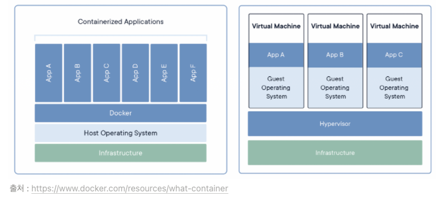

# Docker

> 컨테이너 기반의 가상화 플랫폼

* 하나의 프로그램을 실행시키기 위한 환경을 패키징화 하여 추상화된 컨테이너로 만드는 것
* 가상머신과는 다르게 Host OS의 커널을 공유하여 Cgroup과 Namespace를 이용하여 프로세스를 격리
* 컨테이너 : 어떤 환경에서나 실행하기 위해 필요한 모든 요소를 포함하는 소프트웨어 패키지

_가상머신은 Host OS 및 커널이 전부 가상화되지만 컨테이너는 filesystem의 가상화만을 이루고 있다._

\
\

## Namespace

> 독립적인 공간을 제공하고 각각의 공간이 서로 충돌하지 않도록하는 리눅스 커널의 한 기능

### Namespace의 6가지 기능

* mnt (파일시스템 마운트): 호스트 파일시스템에 구애받지 않고 독립적으로 파일시스템을 마운트하거나 언마운트 가능
* pid (프로세스): 독립적인 프로세스 공간을 할당
* net (네트워크): namespace간에 network 충돌 방지 (중복 포트 바인딩 등)
* ipc (SystemV IPC): 프로세스간의 독립적인 통신통로 할당
* uts (hostname): 독립적인 hostname 할당
* user (UID): 독립적인 사용자 할당

\

## Cgroup

> 가용할 수 있는 자원의 제한을 설정하는 것

### Group으로 제어할 수 있는 리소스

* 메모리
* CPU
* I/O
* 네트워크
* device 노드(/dev/)

## Reference

* [Docker(container)의 작동 원리: namespaces and cgroups](https://tech.ssut.me/what-even-is-a-container/)
