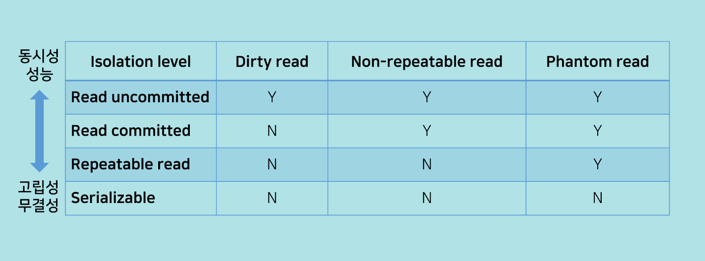

# Network - Basic Theory

## 1. 네트워크란?

* 노드들이 서로 자원을 공유할 수 있도록 허용하는 통신망
* 네트워크 기능이 없는 컴퓨터는 이제 깡통이나 다름 없음
* 프로그램에도 네트워크 기능 구현이 필요하게 되었음

### 1. 1 이것이 네트워크

#### 소규모 네트워크 예시

.png>)

#### 회사 네트워크 예시

 (1).png>)

#### 대륙간 네트워크

.png>)

## 2. 프로토콜 (Protocol)

* 네트워크 상의 위치한 컴퓨터들간의 공동규칙 또는 약속
* 네트워크 사이에서 메세지를 주고 받는 양식과 규칙 체계
* 프로토콜 == 네트워크 구조?

\

### 2. 1 네트워크 프로토콜 : OSI 7 계층, TCP / IP 모델

.png>)

#### OSI 7 계층 - 이상적인 구조

* OSI 7 계층 : user app에서 OS를 거쳐 Hardware까지의 길에서 만나는 계층들
* 국제표준화기구(ISO)에서 개발한 모델
* 컴퓨터 네트워크 프로토콜 디자인과 통신을 계층으로 나눈 것

#### TCP / IP 모델 - 현실적인 구조

* ISO 7 Layer는 현실과는 거리가 좀 있음
* 실질적인 통신에 필요한 규약을 정의할 필요가 있음

| OSI 7                 | TCP / IP    | Explain           |
| --------------------- | ----------- | ----------------- |
| Application (응용 계층)   | Application | 실질적인 서비스 제공       |
| Presentation (표현 계층)  | Application | 압축, 암/복호화 - 번역    |
| Session (세션 계층)       | Application | 통신 관리 방법 계층       |
| Transport (전송 계층)     | Transport   | 신뢰성 있는 데이터 전달     |
| Network (네트워크 계층)     | Internet    | 여러 네트워크를 거친 전달    |
| Data-Link (데이터 링크 계층) | Link        | Point-to-Point 통신 |
| Physical (물리 계층)      | Link        | 물리적인 연결           |

#### How use it?

* 네트워크 기능을 탑재한 모든 프로그램(OS 포함)은 이 프로토콜에 맞춰 통신을 해야 한다.
* **캡슐화** : 보내고 싶은 데이터가 있다면 차례대로 캡슐을 씌워 전송해야된다.
* 데이터를 받는 쪽에서도 캡슐을 하나씩 차례대로 해제한 후 그 안에 담긴 메세지를 확인 가능
* 개발자는 아래쪽에 위치한 계층을 몰라도 됨: OS 역활

#### 캡슐화

.png>)

* 캡슐를 입힌다 : 정보를 답는다.
* 캡슐을 벗긴다 : 정보를 빼서 해석한다.

\

### 2. 2 채팅과 프로토콜

#### 예시

* 메신저앱에서 메시지를 전송하는 상황

 (1).png>)

###

## 3. 네트워크와 인터넷

### 3. 1 근거리 네트워크

#### Point-to-Point 연결

**PPP(Point-to-Point Protocol) - 점대점 통신 약속(두대의 PC)**

.png>)

* 두 통신 노드 간의 직접적인 연결을 위해 사용
* Data-Link Protocol
* 사실 둘만 대화 잘 되면 복잡한 프로토콜 필요 없음

\

#### Local Area Network

.png>)

#### **근거리 통신망. LAN의 등장(1964)**

* 한정된 지역에서 컴퓨터를 기본으로 하는 여러 전자기기 사이의 자유로운 정보교환
* 여기서부터 네트워크라는 용어가 의미를 가진다.
* 여럿이 통신하려면 주소가 필요
  * MAC(Media Access Control):NIC 주소
  * **00:0C:29:09:93:6A 몇비트 일까?**
* 서로 내가 먼저 통신하려고 싸우면?
  * CSMA / CD : 잘 보고 들어가고, 충돌나면 그 사실을 컴퓨터가 알 수 있도록 해 주는 기술

### 3. 2 이것이 인터넷

#### **LAN 토폴로지 : 통신망 구조**

* 이 컴퓨터들을 어떤 모양으로 연결해야될까?
* LAN 토폴로지 : 통신망 구조

.png>)

* 웹서버는 Star Topology 방식을 따른다.

#### 연결 장치

* 더미 허브(Hub) : 그냥 연결만 해줄 뿐
* 스위치 : 데이터 전달만 하는 것이 아니라 데이터흐름 나름 제어하는 장치 (안정적임)

#### 광역 통신망. WAN

* 광역 통신망 (네트워크를 확장)
* 서로 다른 네트워크를 연결
* MAC 주소로 통신을?
  * 대규모 네트워크를 고려해서 만든 주소가 아님.
  * 다른 대체 수단이 필요함! **Internet Protocal(IP)**

#### 인터넷

* 인터넷 프로토콜 스위트(TCP/IP)를 기반으로 하여 전세계적으로 연결된 컴퓨터 네트워크
* Deep Web ?

## 4. 주소체계

### 4. 1 인터넷 프로토콜 (IP)

* 인터넷을 하기 위한 프로토콜
* IP주소 : 인터넷 상에서 컴퓨터를 찾아가기 위해 사용하는 주소
* 정의, 역활, 헤더(spec)

.png>)

#### 생각해 볼 문제

* 213.42.102.34 / 192.168.0.1 / 1.1.1.1 / 127.0.0.1 ——> $8bit$ ($2^8 = 256$) $\* 4 = 32 bit$
* 최대로 할당 가능한 IP 개수?
* IP 주소 / Netmask / Gateway / DNS
* 공인 IP / 사설 IP
  * 실제 사용하는 IP / 한 IP로 공유하는 별칭 IP
* 유동 IP vs 고정 IP
  * IP 주소가 제한적이기때문에 일일이 IP주소를 부여해줄 수 없다.
* IP 대역이 어떻게 되나요?
* 서버 주소가 어떻게 돼?
* 지금의 IP로는 부족하다! (IPv4 → IPv6)
* ipconfig / ifconfig : 사설대역
* whatismyip : 공인 IP

### 4. 2 라우팅

* 다른 네트워크는 어떻게 찾아갈까?
* 목적지 네트워크 까지 최단시간에 가기위해

#### 라우터

* 네트워크 길잡이(=L3 스위치)
* 목적지를 찾아가기 위한 경로 정보를 제공
* 라우팅 프로토콜: OSPF, IGRP, RIP BGP 등
* 지금 맞닿아있는 경로정보를 가지고 있다.
* 라우팅 경로 명령어 : `traceroute` `주소`

``

## 5. 전송, 응용계층

### 5. 1 연결 방식 - TCP

* IP가 엇떻게 통신하지? 라는 것이었다면, TCP는 연결해서 엇떻게 대화를 주고받지? 이다.

#### TCP(Transmission Control Protocol) - 전화

 (2).png>)

* 전송 제어 프로토콜 : 신뢰성 있는 연결 성립을 위한 프로토콜
* 신뢰성 보장, 혼잡 제어, 흐름 제어 (netstat - an)
* 실전화 같은 느낌
* 각각의 프로그램은 포트에 연결되어있고 실제로 연결되는 것은 포트와 포트끼리

#### 3-Way Handshaking

.png>)

* 전송 제어 프로토콜 : 신뢰성 있는 연결 성립을 위한 프로토콜
* 서로간에 통신을 하겠다고 선언을 한 후 대화를 하자(암구어)
* 대화가 종료된 다음에는? 근데 귀찮게 매번 이렇게 해야돼?

\

### 5. 2 UDT(User Datagram Protocol) - 우편

 (1).png>)

* 편지가 간혹 안 갈때도 있지만 그런 일은 거의 없다.
* 모든 연결을 신뢰성있게 해야 하는 것은 아니다!
  * FPS 게임에서 총 쏠 때!
  * 영상 스트리밍할 때!
* 3-Way Handshaking 없이 그냥 툭 던진다.

### 5. 3 Port : 네트워크 통신의 종단점

* 포트가 열려있다! - 외부와의 연결 채널이 열렸다.
* 통신을 한다 - 해당 포트의 규격(프로토콜)으로 서로가 대화한다.
* 포트번호 1~~65535번 (1~~1023번은 well-known 포트)
* 실습: netstat
* 이용할때는 포트를 신경쓰지 않아도 되지만, 제공해야될때는 포트를 신경써야된다.
* **80포트, 443포트는 웹개발할 때 쓰이니 기억하기바람**

#### Well-known 포트

* 자주 쓰는, 반드시 필요한 포트는 번호를 정해놓고 쓴다.
* 만약, 포트 번호를 지키지 않는다면?

#### 새로운 프로그램을 개발했다. 어떤 포트를 쓸까?

* 포트를 쓴다는 것은 무슨 의미일까?
* 개발자가 어디까지 신경써야 할까?

###

## 6 브라우저 통신

### 6. 1 브라우저에서 [www.google.com](http://www.google.com/) 을 접속한다?

* [www.google.com은](http://www.google.xn--com-7e0o/) 주소인가? - 도메인!
* 사람은 숫자보다 단어에 강하다
* 도메인 주소는 실제 통신에 사용되는 주소가 아니다!

\

### 6. 2 DNS(Domain Name System) - 프로토콜

* 도메인 네임 시스템
* 도메인 이름을 네트워크 주소로 바꾸거나 그 반대를 수행

#### DNS 서버

**Server**

* 클라이언트에게 네트워크를 통해 정보나 서비스를 제공하는 컴퓨터(server computer) 또는 프로그램(server program)
* 클라이언트(Client) = 서버에 접속 가능한 프로그램이나 서비스
* DNS 서버 : 도메인 이름을 해석해 주는 서버(실습:nslookup)

**두 컴퓨터가 통신을 하려면**

* 양쪽 다 채널이 열려 있어야하고(포트)
* 통신을 기다리는 쪽(서버)과 시작하는 쪽(클라이언트)이 필요하고
* 통신하는 방식에 대한 합의가 필요(프로토콜)

\

### 6. 3 HTTP

.png>)

* Application 계층에서 존재한다. (DNS도 마찬가지)
* HyperText Transfer Protocol
* www 상에서 정보를 주고받을 수 있는 프로토콜
* 우리가 보통 `웹통신`이라고 부르는 것을 가능하게 해 줌

#### WWW(World Wide Web)

* 인터넷에 연결된 컴퓨터를 통해 정보를 공유할 수 있는 정보 공간
* HTTP로 연결하고, 데이터는 HTML로 공유한다.

#### Stateless 프로토콜

* 각각의 요청을 독립적인 트랜잭션으로 취급하는 프로토콜
* HTTP : 사용자끼리는 몰라도 된다.

#### Stateful 프로토콜

* 서버 내부 상태 유지를 요구하는 프로토콜
* TCP : 세션을 맺고 지속적으로 유지한다.

#### HTTP 헤더

.png>)

\

### 6. 4 와이 파이

* 컴퓨터 시스템들이 무선랜에 연결할 수 있도록 해주는 기술
* 무선랜(Wireless LAN)
  * IEEE 802.11 표준을 기반으로 하는 무선 통신 기술
  * Wifi 와 OSI 7 Layer

 (2).png>)
