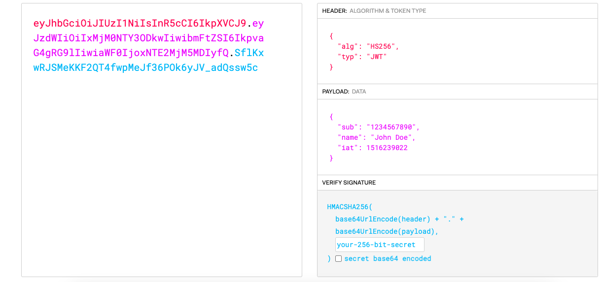

# JWT

> JSON 포멧을 이용하여 사용자에대한 속성을 저장하는 Claim(속성 정보) 기반의 Web Token 으로서
>
> 토큰 자체를 정보로 사용하는 `Self-Contained` 방식으로 정보를 안전하게 전달

\

## JWT 구조

* JWT 는 Header, Payload, Signature 로 이루어져있다.
* 각 부분은 `json` 형태를 Base64Url 방식으로 인코딩되어 표현
  * 여기서 Base64Url은 암호된 문자열이 아니라서 같은 문자열에대해서 항상 같은 인코딩 문자열을 반환
* 점(.) 구분자를 이용하여 구분

### Header

* `Signature`를 해싱하기 위한 알고리즘을 지정
* `alg` 와 `typ` 로 구성
  * `alg`: 알고리즘 방식을 나타냄, 서명 및 토큰 검증에 사용, ex) HS256(SHA256) 또는 RSA
  * `typ`: 토큰의 타입을 나타냄

### Payload

* 토큰에서 사용할 정보들의 조각들인 `claim`이 모여있다.
* 클레임은 `Registered Claim`, `Public Claim`, `Private Claim` 으로 총 3가지 나뉜다.
* 클레임은 `Json(Key : Value)` 형태로 저장되어진다.

#### 1. Registered Claim

* 토큰 정보를 표현하기 위해 이미 정해진 종류의 데이터
* JWT를 간결하게 하기위해 Key의 문자열 길이가 3
* [등록된 클레임 필드](https://en.wikipedia.org/wiki/JSON\_Web\_Token#Standard\_fields)

#### 2. Public Claim

* 사용자 정의 클레임으로, 공개용정보를 위해 사용

#### 3. Private Claim

* 사용자 정의 클레임으로, 서버와 클라이언트 사이에서 임의로 지정한 정보를 저장

### Signature

* 메세지가 변조되지 않았음을 확인하는 영역
* `Base64Url` 인코딩한 내용인 `header` 와 `payload` 로 `Signature`를 생성한다.

\

## 내가생각하는 JWT를 사용하는 이유, 단점

* 세션방식의 인증인가 방식은 서버에 부하를 주는 방식보다 Client 마다 Token정보를 저장하고 필요할때마다 요청과함께 토큰을 보내 서버에 부담을 줄일 수 있다.
* 즉 서버에서 따로 인증정보를 저장할 필요가 없어서 JWT를 사용하지 않나 싶다.
* 물론 단점으로는 `Payload` 에 중요한 `Claim` 을 넣어두면 탈취의 가능성이 있기 때문에 `Claim` 에 신경써야되고
* 인증정보의 만료시점이 있기 때문에 갱신시켜야되는 과정이 추가적으로 발생해야된다는 점이다.
