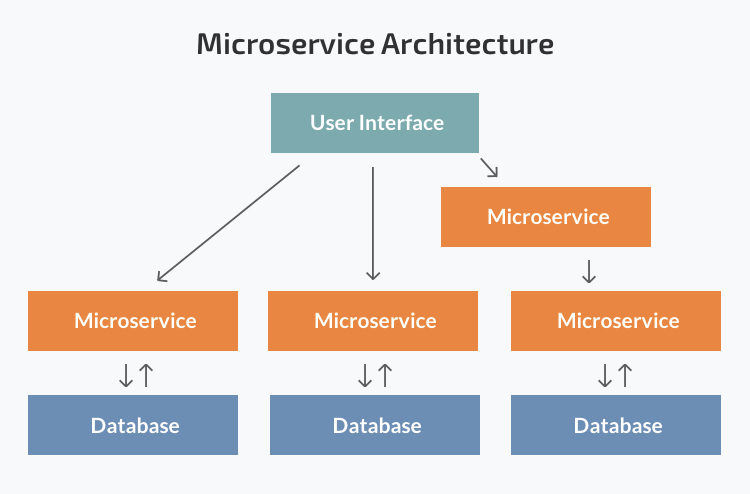

# Monolithic and Microservice

## Monolithic Architecture

> 모놀리식 아키텍처란 하나의 소프트웨어를 구성하는 모듈과 코드를 한 프로젝트에서 관리하는 것

위의 사진에서 보듯이 각각의 구성이 연결되어 있고, 단일 데이터베이스를 가지고 있다.

### 모놀리식 아키텍처의 장점

#### 모든 코드가 단일프로젝트에 구성되어 있다.

* **단순성**: 앱을 구성하는 모든 코드가 한 곳에 있다보니, 단일 어플리케이션만 실행하면 된다.
* **손쉬운 배포** : 단일 프로젝트만 배포하면 되므로 배포가 쉽다.
* **쉬운 디버깅** : 모든 코드가 단일 어플리케이션에 있기 때문에 추가구성 없이 쉬운 디버깅이 가능
* **테스트 용이성** : 다른 앱과 통신하거나 신경쓸 필요없이 단일앱만 신경쓰면 되기 때문에 테스트하기 쉽다.
* **모니터링 용이성** : 단일 앱에 모든 코드가 있어 오류/버그 가 생기면 쉽게 알아낼 수 있다.

### 모놀리식 아키텍처의 단점

#### 서비스가 커지고 복잡해질 수록

* 서비스 확장이 어려워진다.
* 코드를 이해하는 것이 어려워진다. -> 코드 수정 및 추가가 힘들다.

#### Unscalable - 확장이 불가능하다.

* 단일앱의 구성요소마다 리소스 요구사항이 달라(하나는 CPU를 많이 사용하고, 하나는 메모리를 많이 사용하는..), 각 구성요소별로 확장시킬 수가 없다.
  * ex) 유저서비스를 확장하고 싶은경우 유저서비스 구성요소만만 따로 확장할 수가없다.

#### Unreliable - 신뢰할 수 없다.

* 하나의 구성요소가 다운되거나 에러가나면 다른 구성요소에게도 영향을 끼쳐 전체 서비스가 실행되지 않는다.

#### Inflexible - 유연성이 없다.

* 새로운 언어나 프레임워크를 채택하여 앱을 구성하게되면 기존에 있던 코드를 전부 바꿔야된다.
  * 새로운 언어나 프레임워크를 채택하여 앱을 구성하는 것이 힘들다.

\

## Microservice Architecture

> 마이크로 서비스 아키텍처는 하나의 소프트웨어를 구성하는 컴포넌트들을 독립적인 프로젝트들로 분리하여 관리하고 각각의 마이크로서버(컴포넌트)들은 API를 통해 서로 통신한다.

### 마이크로서비스의 장단점

#### 장점

* **전체적으로 분리되어있고, 마이크로 서비스별로 보았을 때 모노리식 서비스보다 규모가 작다.**
  * 코드의 구조와 흐름을 이해하기 쉽다.
  * 마이크로 서비스간 결합이 느슨하여 마이크로 서비스별로 확장이나 수정이 용이하다.
  * 개발속도가 시간이 지날수록 빨라짐(각 마이크로서비스 별로 팀이 구성되어 있을 경우)
  * 각 마이크로서비스별로 테스트, 빌드, 배포 속도가 빨라짐
* **모놀리식 서비스와는 다르게 각 마이크로 서비스는 별개로 구성할 수 있다.**
  * 마이크로 서비스 별로 컴퓨팅 리소스(CPU, Memory, 등)를 다르게 가져갈 수 있다.
  * 기술 스택을 마이크로 서비스별로 다르게 가져갈 수 있다.(Java 로 구성된 Microservice, Go로 구성된 Microservice)

\\

#### 단점

* 각 마이크로서비스가 분산되어있다.
  * 서비스를 통합하여 테스트할 때 난이도가 높아진다.
  * 처음의 각 마이크로 서비스를 나누는 기준을 정하는 것이 어렵다. -> 잘못하면 마이크로 서비스간 결합이 강해져 관리비용이 늘어날 수 있다.
  * 전체적인 서비스를 이해하기 어렵다.
  * 분산 트랜잭션 처리등 분산 시스템 환경에서 처리해야할 고민들이 있다.
