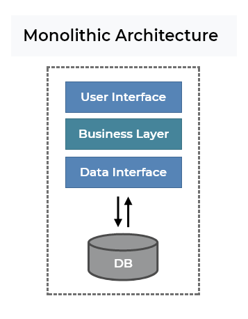

# Monolithic and Microservice Architecture

> 모놀리식 아키텍처와 마이크로서비스 아키텍처 모두 어플리케이션을 생성하는 데 사용하는 아키텍처

## Monolithic Architecture

> 모놀리식 아키텍처란 하나의 소프트웨어를 구성하는 모듈과 코드를 한 프로젝트에서 관리하는 것

 

위의 사진에서 보듯이 각각의 구성이 연결되어 있고, 단일 데이터베이스를 가지고 있다.

### 모놀리식 아키텍처의 장점

#### 모든 코드가 단일프로젝트에 구성되어 있다.
- **단순성**: 앱을 구성하는 모든 코드가 한 곳에 있다보니, 단일 어플리케이션만 실행하면 된다.
- **손쉬운 배포** : 단일 프로젝트만 배포하면 되므로 배포가 쉽다.
- **쉬운 디버깅** : 모든 코드가 단일 어플리케이션에 있기 때문에 추가구성 없이 쉬운 디버깅이 가능
- **테스트 용이성** : 다른 앱과 통신하거나 신경쓸 필요없이 단일앱만 신경쓰면 되기 때문에 테스트하기 쉽다.
- **모니터링 용이성** : 단일 앱에 모든 코드가 있어 오류/버그 가 생기면 쉽게 알아낼 수 있다.

### 모놀리식 아키텍처의 단점

#### 서비스가 커지고 복잡해질 수록
- 서비스 확장이 어려워진다.
- 코드를 이해하는 것이 어려워진다. -> 코드 수정 및 추가가 힘들다.

#### Unscalable - 확장이 불가능하다.

- 단일앱의 구성요소마다 리소스 요구사항이 달라(하나는 CPU를 많이 사용하고, 하나는 메모리를 많이 사용하는..), 각 구성요소별로 확장시킬 수가 없다.
  - ex) 유저서비스를 확장하고 싶은경우 유저서비스 구성요소만만 따로 확장할 수가없다.

#### Unreliable - 신뢰할 수 없다.

- 하나의 구성요소가 다운되거나 에러가나면 다른 구성요소에게도 영향을 끼쳐 전체 서비스가 실행되지 않는다.

#### Inflexible - 유연성이 없다.

- 새로운 언어나 프레임워크를 채택하여 앱을 구성하게되면 기존에 있던 코드를 전부 바꿔야된다.
  - 새로운 언어나 프레임워크를 채택하여 앱을 구성하는 것이 힘들다.

- **서비스가 커질수록 유지관리가 어려움** : 서비스가 커질 수록 

